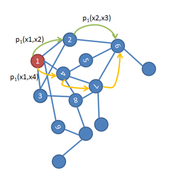

It occurs to me in my previous post I didn't thoroughly explain the motivation
for dimension reduction in general. When we have this data matrix $X$ with $n$
samples and each sample having $m$ features, this number m can be very large.
This data contains information that we want to extract, in the case of molecular
dynamics simulations these are parameters describing how the dynamics are occurring.
But this can be be features that distinguish faces from others in the dataset,
handwritten letters and numbers from other numbers, etc. As it is so eloquently put
by [Porte and Herbst at Arizona][PorteHerbst]

>The breakdown of common similarity measures hampers
>the efficient organisation of data, which, in turn, has
>serious implications in the field of pattern recognition.
>For example, consider a collection of n × m images,
>each encoding a digit between 0 and 9. Furthermore, the
>images differ in their orientation, as shown in Fig.1. A
>human, faced with the task of organising such images,
>would likely first notice the different digits, and thereafter
>that they are oriented. The observer intuitively attaches
>greater value to parameters that encode larger variances in the observations,
> and therefore clusters the data in 10 groups, one for each digit

Here we've been introduced to the idea of pattern recognition and 'clustering',
the latter will be discussed in some detail later. Continuing on...

>On the other hand, a computer sees each image as a
>data point in $R^{nm}$, an nm-dimensional coordinate space.
>The data points are, by nature, organised according to
>their position in the coordinate space, where the most
>common similarity measure is the Euclidean distance.

The idea of the data being in a $nm$ dimensional space is introduced by the
authors. The important part is that a computer has no knowledge of the the patterns
inside this data. The human brain is excellent at plenty of algorithms, but dimension
reduction is one it is especially good at.

Start talking about some chemistry John!
----------------------------------------
----------------------------------------
Fine! Back to the matter at hand, dimension reduction is an invaluable tool in
modern computational chemistry because of the massive dimensionality of molecular
dynamics simulations. To my knowledge, the biggest things being studied by MD
currently are on the scale of the [HIV-1 Capsid][HIV Capsid] at 64 million atoms!
Of course, these studies are being done on supercomputers, and for the most part
studies are running on a much smaller number of atoms. For a thorough explanation
of how MD simulations work, my Summer of Code colleague [Fiona Naughton][Fiona_MD]
has an excellent and cat-filled post explaining MD and Umbrella Sampling. Why do we
care about dynamics? As [Dr. Cecilia Clementi][Cecilia] mentions in her [slides][ClementiSlides],
'Crystallography gives structures', but function requires dynamics!'

A molecular dynamics simulation can be thought of as a diffusion process subject
to drag (from the interactions of molecules) and random forces, (brownian motion).
This means that the time evolution of the probability density of a molecule occupying
a point in the configuration space $P(x,t)$ satisfies the [Fokker-Plank Equation](https://en.wikipedia.org/wiki/Fokker%E2%80%93Planck_equation)
(This is some complex math from statistical mechanics). The important thing to note
is that the Fokker-Plank equation has a discrete eigenspectrum, and that there
usually exists a spectral gap reflecting the 'intrinsic dimensionality' of the
system it is modeling. A diffusion process is by definition markovian, in this case a continuous
markov process, which means the state at time t is solely dependent on the instantaneous
step before it. This is easier when transferred over to the actual discrete problems
in MD simulation, the state at time $t$ is only determined by the state at time $t-1$.

Diffusion maps in MD try to find a discrete approximation of the
eigenspectrum of the Fokker-Plank equation by taking the following steps. First, we can think of
changes in configuration as random walks on an infinite graph defined by the
configuration space.  From [Porte][PorteHerbst] again:

>The connectivity between two data points, x and y, is
>defined as the probability of jumping from x to y in one
>step of the random walk, and is

$$ connectivity(x,y) = p(x,y) $$

>  It is useful to express this connectivity in terms of a non-normalised
> likelihood function, k, known as the diffusion kernel:

$$ connectivity  \propto  k(x,y) $$

>The kernel defines a local measure of similarity within
>a certain neighbourhood. Outside the neighbourhood, the
>function quickly goes to zero. For example, consider the
>popular Gaussian kernel:

$$ k(x,y) = \exp(-\frac{|x-y|^{2}}{\epsilon}) $$

[Coifman and Lafon][LafonDiffusion] provide a dense but extremely thorough explanation of diffusion maps in their seminal paper. This quote screams molecular dynamics:

>Now, since the sampling of the data is generally not related to the geometry of the manifold, one would like to recover the manifold structure regardless of the distribution of the data points. In the case when the data points are sampled from the equilibrium distribution of a stochastic dynamical system, the situation is quite different as the density of the points is a quantity of interest, and therefore, cannot be gotten rid of. Indeed, for some dynamical physical systems, regions of high density correspond to minima of the free energy of the system. Consequently, the long-time behavior of the dynamics of this system results in a subtle interaction between the statistics (density) and the geometry of the data set.

In this paper, the authors acknowledge that oftentimes an isotropic kernel is not sufficient to understand the relationships in the data. He poses the question:

>In particular, what is the influence of the density of the points and of the geometry of the possible underlying data set over the eigenfunctions and spectrum of the diffusion?
 To address this type of question, we now introduce a family of anisotropic diffusion processes that are all obtained as small-scale limits of a graph Laplacian jump process. This family is parameterized by a number $\alpha$ which can be tuned up to specify the amount of influence of the density in the infinitesimal transitions of the diffusion. The crucial point is that the graph Laplacian normalization is not applied on a >graph with isotropic weights, but rather on a renormalized graph.

The derivation from here requires a few more steps:

+	Form a new kernel from anisotropic diffusion term: Let $$ q_{\epsilon}(x) = \int k{\epsilon}(x,y)q(y) \,dy$$  
    Where
	$$ k{\epsilon}^{(\alpha)} =  \frac{k{\epsilon}(x,y)}{q{\epsilon}(x) q{\epsilon}(y) }$$
+	Apply weighted graph Laplacian normalization:
	$$ d{\epsilon}^{(\alpha)}(x) = \int k{\epsilon}^{(\alpha)}(x,y)q(y) \,dy $$
+	Define anisotropic transition kernel from this term
	$$ p{\epsilon,\alpha}(x, y) =   \frac{k{\epsilon}^{(\alpha)}(x,y)}{d_{\epsilon}^{(\alpha)}(x)}$$

This was all kinds of painful, but what this means for diffusion maps in MD is
that a meaningful diffusion map will have an anisotropic, (and therefore unsymmetric kernel).
[Coifman and Lafon][LafonDiffusion] go on to prove that for $\alpha$ equal to $\frac{1}{2}$
this anisotropic kernel is an effective approximation for the Fokker-Plank equation!
This is a really cool result that is in no way obvious.

Originally, when I studied diffusion maps while applying for the Summer of Code
I was completely unaware of Fokker-Plank and the anisotropic kernel. Of course,
learning these topics takes time, but I was under the impression that diffusion
kernels were symmetric across the board, which is just dead wrong. This of course
changes how eigenvalue decomposition can be performed on a matrix and requires a
routine like Singular Value Decomposition instead of Symmetric Eigenvalue Decomposition.
If I had spent more time researching literature on my own I think I could have figured this out.
With that being said, there are 100+ dense pages given in the citations below.

So where are we at? Quick recap about diffusion maps:
+	Start taking random walks on a graph
+	There are different costs for different walks based on likelihood of walk happening
+	We established a kernel based on all these different walks
+	For MD we manipulate this kernel so it is anisotropic!

Okay, so what do we have left to talk about...
+	How is epsilon determined?
+	What if we want to take a random walk of more than one jump?
+	Hey John, we’re not actually taking random walks!
+	What do we do once we get an eigenspectrum?
+	What do we use this for?

Epsilon Determination
---------------------
Epsilon determination is kind of funky. First off, [Dr. Andrew L. Ferguson][Ferguson] notes
that division by epsilon retrains ‘only short pairwise distances on the order of $\sqrt{2\epsilon}$’.
In addition, [Dr. Clementi][Cecilia] in her [slides][ClementiSlides] on diffusion maps notes that the
neighborhood determined by epsilon should be locally flat. For a free-energy surface, this means that it
is potentially advantageous to define a unique epsilon for every single element of a kernel based on the
nearest neighbors to that point in terms of value. This can get painful.
Most researchers seem to use constant epsilon determined from some sort of guess and check method based on clustering.

For my GSoC pull request that is up right now, the plan is to have an API
for an `Epsilon` class that must return a matrix whose $ij th$ coordinate is $\frac{d(i,j)^2}{\epsilon_ij }$.
From here, given weights for the anisotropy of the kernel, we can form the anisotropic kernel
to be eigenvalue-decomposed. Any researcher who cares to do some complex choice
of epsilon based on nearest-neighbors is probably a good enough hacker to handle implementation of this API in a quick script.

Length $t$ Walks
------------------
Nowhere in the construction of our diffusion kernel are we actually taking random walks.
What we are doing is taking all possible walks, where two vertices on the graph are close if $d(x,y)$ is small
and far apart if $d(x,y)$ is large. This accounts for all possible one-step walks across our data.
In order to get a good idea of transitions that occur over larger timesteps, we take multiple steps.
To construct this set of walks, we must multiply our distance matrix $P$ by itself t-times,
where t is the number of steps in the walk across the graph.
From Porte again (stealing is the best form of flattery, no?):

>With increased values of t (i.e. as the diffusion process
“runs forward”), the probability of following a path
along the underlying geometric structure of the data set
increases. This happens because, along the geometric
structure, points are dense and therefore highly connected
(the connectivity is a function of the Euclidean distance
between two points, as discussed in Section 2). Pathways
form along short, high probability jumps. On the other
hand, paths that do not follow this structure include one
or more long, low probability jumps, which lowers the
path’s overall probability.

I said something blatantly wrong in my last post. I'm a fool, but still, things do
get a little complicated when analyzing time series data with diffusion maps.
We want to both investigate different *timescale* walks from the diffusion maps,
but also to be able to project our snapshot from a trajectory at a *timestep*
to the corresponding set of eigenvectors describing the lower dimensional order-parameters.

From [Ferguson][Ferguson]:

>The <strong>diffusion map embedding</strong> is defined as the mapping of the
ith snapshot into the ith components of each of the top k non-trivial
eigenvectors of the $M$ matrix.

Here the $M$ matrix is our anisotropic kernel. So from a spectral decomposition
of our kernel (remember that it is generated by a particular *timescale* walk), we get a
set of eigenvectors that we project our snapshot (what we have been calling a both a trajectory frame and a sample, sorry)
that exists as a particular *timestep* in our MD trajectory. This can create some
overly similar notation, so I'm just going to avoid it and hope that it makes more
sense without notation.

Using Diffusion Maps in MDAnalysis
-----------------------------------
Alright, this has been a lot to digest, but hopefully you are still with me.
Why are we doing this? There are plenty of reasons, and I am going to list a few:

+   Dr. Ferguson used diffusion maps to investigate the assembly of polymer subunits in
    [this paper][Ferg_machinelearning]
+   Also for the order parameters in [alkane chain dynamics][Ferg_chain]
+   Also for [umbrella sampling][Ferg_WHAM]
+   Dr. Clementi used this for protein folding order parameters [here][Clementi_FreeEnergyLandscapes]
+   Also, Dr. Clementi used this for polymerization reactions [here][Clementi_PolymerReversalRate]
+   Dr. Clementi also created a variant that treats epsilon determination very
    carefully with [LSD][Clementi_DiffusionReaction]
+   There are more listed in my works cited

The first item in that list is especially cool; instead of using a standard
RMSD metric, they abstracted a cluster-matching problem into a graph matching problem,
using an algorithm called Isorank to find an approximate 'greedy' solution.

There are some solid 'greedy' vs. 'dynamic' explanations [here](https://www.quora.com/Greedy-algorithm-vs-dynamic-programming-Whats-the-difference).
The example I remember getting is to imagine you are a programmer for a GPS
direction provider. We can consider two ways of deciding an optimal route, one
with a greedy algorithm and the other with a dynamic algorithm.
At each gridpoint on a map, a greedy algorithm will take the fastest route at
that point. A dynamic algorithm will branch ahead, look into the future, and possibly
avoid short-term gain for long term drive-time savings. The greedy algorithm
might have a better best-case performance, but a much poorer worst-case performance.

In any case, we want to allow for the execution of a diffusion map algorithm where
a user can provide their own metric, tune the choice of epsilon, the choice of timescale,
and project the original trajectory *timesteps* onto the new dominant eigenvector, eigenvalue pairs.

Let’s talk API/ Actual Coding (HOORAY!)
--------------
`DistMatrix`
+   Does frame by frame analysis on the trajectory, implements the `_prepare`
    and `_single_frame` methods of the `BaseAnalysis` class
+   User selects a subset of a atoms in the trajectory here
+   This is where user provides their own metric, cutoff for when metric is equal,
    weights for weighted metric calculation, and a start, stop, step for frame
    analysis

`Epsilon`
+   We will have some premade classes inheriting from epsilon, but all the API
    will require is to return the manipulated `DistMatrix`, where each term has
    now been divided by some scale parameter epsilon
+   These operations should be done in place on the original `DistMatrix`,
    under no circumstances should we have two possibly large matrices sitting in
    memory

`DiffusionMap`
+   Accepts `DistMatrix` (initialized), `Epsilon` (uninitialized) with default a premade `EpsilonConstant`
    class, timescale t with default = 1, weights of anisotropic kernel as parameters
+   Performs `BaseAnalysis` conclude method, wherein it exponentiates to the negative of
    each term given by `Epsilon.scaledMatrix`, performs the procedure for the creation
    of the anisotropic kernel above, and matrix multiplies anisotropic kernel by the timescale t.
+   Finally, eigenvalue decomposes the anisotropic kernel and holds onto the
    eigenvectors and eigenvalues as attributes.
+   Should contain a method `DiffusionMap.embedding(timestep)`, that projects
    a timestep to its diffusion embedding at the given timescale t.

Jargon Box
----------
+   [Crystallography](https://en.wikipedia.org/wiki/Crystallography)
+   [Metric](https://en.wikipedia.org/wiki/Metric_(mathematics))
+   [Configuration Space](https://en.wikipedia.org/wiki/Configuration_space)
+	[Random Walk](https://en.wikipedia.org/wiki/Random_walk)
+   [Markov Process](https://en.wikipedia.org/wiki/Markov_process)
+   [Diffusion Process](https://en.wikipedia.org/wiki/Diffusion_process)
+   [Fokker-Plank Equation](https://en.wikipedia.org/wiki/Fokker%E2%80%93Planck_equation)
+   [Isotropic](https://en.wikipedia.org/wiki/Isotropy)
+   [Anisotropic](https://en.wikipedia.org/wiki/Anisotropy)
+   [RMSD](https://en.wikipedia.org/wiki/Root-mean-square_deviation_of_atomic_positions)
+   [Isorank](https://groups.csail.mit.edu/cb/mna/)

Works Cited:
+   [An Introduction to Diffusion Maps][PorteHerbst]
+   [Diffusion Maps][LafonDiffusion]
+   [Everything you wanted to know about Markov State Models but were afraid to ask][MarkovStateModels]
+   [Diffusion Maps, Spectral Clustering and Eigenfunctions of Fokker-Planck Operators][LafonFokker-Plank]
+   [Nonlinear dimensionality reduction in molecular simulation: The diffusion map approach][Ferg_Approach]
+   [Integrating diffusion maps with umbrella sampling: Application to alanine][Ferg_WHAM]
+   [Systematic determination of order parameters for chain dynamics using diffusion maps][Ferg_chain]
+   [Nonlinear Machine Learning of Patchy Colloid Self-Assembly Pathways and Mechanisms][Ferg_machinelearning]
+   [Low-Dimensional Free Energy Landscapes of Protein Folding Reactions by Nonlinear Dimensionality Reduction][Clementi_FreeEnergyLandscapes]
+   [Determination of reaction coordinates via locally scaled diffusion map][Clementi_DiffusionReaction]
+   [Polymer reversal rate calculated via locally scaled diffusion map][Clementi_PolymerReversalRate]
+   [Machine Learning Based Dimensionality Reduction Facilitates Ligand Diffusion Paths Assessment: A Case of Cytochrome P450cam][Diffusion_Cytochrome]
+   [Diffusion maps, clustering and fuzzy Markov modeling in peptide folding transitions][DiffusionAlaninePeptide]

[PorteHerbst]: http://dip.sun.ac.za/~herbst/research/publications/diff_maps_prasa2008.pdf
[Ferg_Approach]: http://ferguson.matse.illinois.edu/resources/5.pdf
[Ferg_WHAM]: http://ferguson.matse.illinois.edu/resources/4.pdf
[Ferg_chain]: http://ferguson.matse.illinois.edu/resources/2.pdf
[Ferg_machinelearning]: http://ferguson.matse.illinois.edu/resources/10.pdf
[ClementiSlides]: http://cgl.uni-jena.de/pub/Workshops/WebHome/CGL_workshop1.pdf
[Clementi_FreeEnergyLandscapes]: https://www.cs.rice.edu/CS/Robotics/papers/das2006low-dim-land-folding-dim-reduction.pdf
[Clementi_DiffusionReaction]: http://www.ncbi.nlm.nih.gov/pubmed/21456654
[Clementi_PolymerReversalRate]: http://scitation.aip.org/content/aip/journal/jcp/134/14/10.1063/1.3575245
[Diffusion_Cytochrome]: http://pubs.acs.org/doi/abs/10.1021/acs.jctc.6b00212
[DiffusionAlaninePeptide]: http://scitation.aip.org/content/aip/journal/jcp/141/11/10.1063/1.4893963
[LafonDiffusion]: http://cis-linux1.temple.edu/~latecki/Courses/RobotFall08/Papers/DiffusionMaps06.pdf
[LafonFokker-Plank]: http://papers.nips.cc/paper/2942-diffusion-maps-spectral-clustering-and-eigenfunctions-of-fokker-planck-operators.pdf
[MarkovStateModels]: http://www.ncbi.nlm.nih.gov/pubmed/20570730

[Laurens]: https://lvdmaaten.github.io/
[Cecilia]: https://chemistry.rice.edu/FacultyDetail.aspx?RiceID=238
[Ferguson]: http://ferguson.matse.illinois.edu/page1/
[Lafon]: http://research.google.com/pubs/author22372.html  
[HIV Capsid]: http://www.bio-itworld.com/2013/5/29/researchers-characterize-chemical-structure-hiv-capsid.html
[Fiona_MD]: http://fiona-naughton.github.io/blog/2016/05/25/What-is-this-MD-thing-anyway
