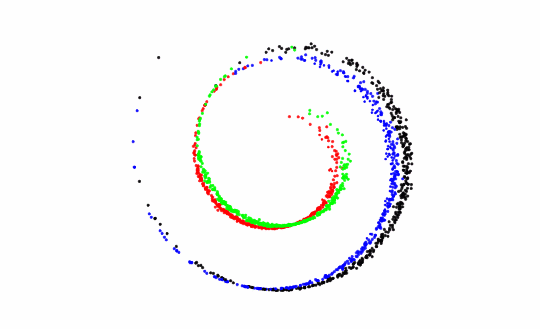
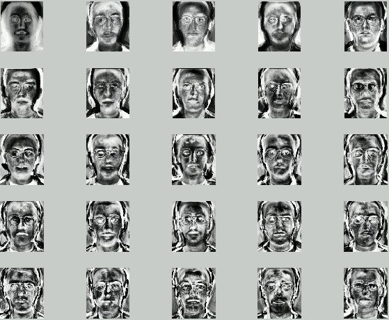
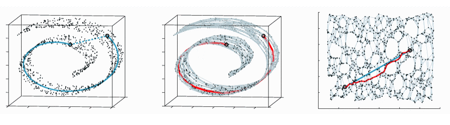
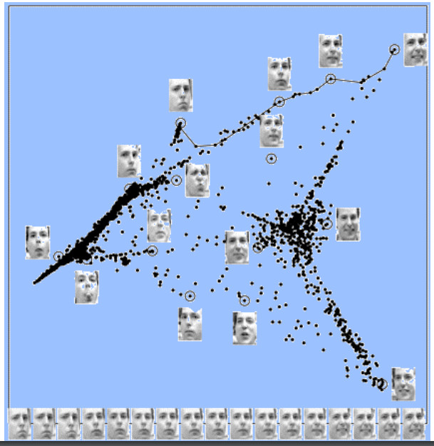

<script type="text/x-mathjax-config">
MathJax.Hub.Config({
  tex2jax: {inlineMath: [['$','$'], ['\\(','\\)']]}
});
</script>
<script type="text/javascript" async
  src="https://cdn.mathjax.org/mathjax/latest/MathJax.js?config=TeX-MML-AM_CHTML">
</script>

Hello! This is my first post moving over to a new site built by
[wintersmith](https://github.com/jnordberg/wintersmith). Originally I was going
to use jekyll pages, but there was an issue with the latest ruby version not being
available for Linux, (maybe macs are better...). I spent *way too much* time
figuring out how to install a markdown plugin that allowed for the inclusion of
Latex. I did this all without realizing I could simply include:
```
<script type="text/javascript" async
  src="https://cdn.mathjax.org/mathjax/latest/MathJax.js?config=TeX-MML-AM_CHTML">
</script>
```
below my article title and latex would easily render. Now that this roadblock is
cleared, I have no excuses preventing me from writing a post about my work.  

<span class="more"></span>

This post is meant to discuss various dimension reduction methods
as a preface to a more in-depth post about diffusion maps
performed on molecular dynamics simulation trajectories. It assumes college-level math skills, but
will try to briefly explain high-level concepts from Math and Stats.
Towards the end I will provide a segue into the next post.

[Dimension reduction](https://en.wikipedia.org/wiki/Dimensionality_reduction)
is performed on a data matrix $ X $ consisting of $n$ 'samples' wherein
each sample has a set of $m$ 'features' associated with it. The data in the matrix
is considered to have dimension $m$, but oftentimes the actual 'intrinsic dimensionality'
is much lower. As Laurens van der Maaten [defines it][1], 'intrinsic dimensionality'
is 'the the minimum number of parameters needed to account for the observed properties of the data'.

(So far, the most didactic explanation of this fact was presented
in a paper on diffusion maps by [Porte et al][2].
In the paper, a dataset of m-by-n pixel pictures of a simple image randomly rotated
originally has dimension $mn$ but after dimension reduction, the dataset can be
organized two dimensionally based on angle-of rotation.)

At the most abstract level, dimension reduction methods usually are posed as an
optimization problem that ultimately requires the solution to an eigenvalue problem.
What is an [optimization problem](https://en.wikipedia.org/wiki/Optimization_problem) you ask?
That wikipedia article should help some, the optimization being done in dimension
reduction is finding some linear or non-linear relation $ M $ that minmizes (or maximizes)
a cost function $ \phi (x) $ on some manipulation of the data matrix, call it $ X_{manipulated} $.
Examples of various functions will be given in detail later.

In most cases this can be turned into an eigenproblem posed as:
$$ X_{manipulated} M = \lambda M $$

Solving this equation using some algorithm like Singular Value Decomposition
or Symmetric Eigenvalue Decomposition will provide a set of m linearly-independent
eigenvectors that act as a basis for a lower dimensional space.
(Linear independence means no vector in the set can be expressed as
some sum of the others, a basis set has the property that any vector in a space
can be written as the sum of vectors in the set.) The set of eigenvectors is of
given by an eigenvalue decomposition will be the 'spectrum' of the matrix $M$.
This spectrum will have what is referred to as a 'spectral gap' after a certain number
of eigenvalues. After these $k$ eigenvalues, the value of all subsequent eigenvalues
is much smaller than all those before them. The number of significant eigenvalues before this
first diminished value reflects the intrinsic dimension $k$ of a space.

In some cases, the manipulation is somewhat more complicated, and creates what
is called a [*generalized eigenvalue problem*](https://en.wikipedia.org/wiki/Eigendecomposition_of_a_matrix#Generalized_eigenvalue_problem).
In these situations the problem posed is $$ X_a M = \lambda X_b M $$
Where $X_a$ and $X_b$ are distinct but both still generated from some manipulation
on the original data matrix X.

The methods discussed so far necessitate the use of convex cost functions for
an optimization. In set theory, convexity indicates that a set contains its subsets.
An open interval $ (a,b) $ is convex whereas the open interval missing a point is not.
Convex functions are similar but not entirely related, a convex function does not
have any *local optima* which means that if you're at a maximum or minimum, you know it is global.

(I think there is a reason why people in optimization refer to surfaces as landscapes.
An interesting surface may have many hills and valleys, and finding an optimal path
is like a hiker trying to cross a mountain path blind --- potentially problematic.)

Convex functions will always achieve the same solution given some input parameters,
but non-convex functions may get stuck on some local optima. This is why a method
like [t-SNE][3] will converge to different results on different iterations.

Methods for dimension reduction will be either linear or non-linear mappings.
In both cases, the original data matrix $X$ is embeddable in some manifold. A manifold
is any surface that is [locally homeomorphic](http://planetmath.org/locallyhomeomorphic) to $R^{2}$.
We want these mappings to preserve both the local structure of the manifold, while also
preserving the global structure. I think the notion of structure is left specifically
vague in literature because it is just so damn weird (it is really hard to think about
things in greater than 3 dimensions...)

A great example of data embeddable in a weird manifold, albeit three dimensional manifold is the swiss roll:
 borrowed from [dinoj](http://people.cs.uchicago.edu/~dinoj/manifold/swissroll.html).
The many different dimension reduction methods available will have disparate
results when performed on this data. When restricted to paths along the manifold,
red data will be far apart from black, but if a simple euclidean distance is measured,
the points might be considered close. A dimension reduction that uses simple euclidean
distance between points to resolve structure will fail miserably to eek out the
swiss roll embedding.

When looking to investigate the lower dimensional space created by a dimension
reduction, linear mappings have an explicit projection provided by the matrix formed
by the eigenvectors. Non-linear methods do not have such an explicit relationship.
Finding physical meaning from the order parameters given by a non-linear technique
is an active area of research.


It might be too small of detail for some, but the rest of this post will be
focused on providing a quick explanation of various dimension reduction techniques.
The general format will be:
+   optimization problem posed
+   formal eigenvalue problem given
+   interesting insights and relations
+   pictures that I like from other work  

Multidimensional Scaling (MDS), Classical Scaling, PCA
------------------------------------------------------
+   PCA cost function: Maximizes $Trace(M^{T}cov(X)M)$
+   PCA eigenvalue problem $ Mv = \lambda v $ where M is this linear mapping minimizing
    the covariance
+   Classical scaling relies on the number of datapoints not the dimensionality.
+   Classical scaling cost function: Minimizes $$ \phi ( Y ) = $ \Sigma ij =  ( d{ij} - || y{i} - y{j} ||^{2} ) $$
    this is referred to as a strain cost function. (subscripts are currently an issue...)
+   Other MDS methods can use stress or squared stress cost functions
+   Classical scaling gives the exact same solution as PCA
+   PCA applied to image data gives this *awesome* term eigenfaces, an example
    of which can be found below:
    

Isomap
------
+   Geodesic distances are computed by constructing a nearest-neighbor graph and
    using [Djistrka’s algorithm](https://www.youtube.com/watch?v=2E7MmKv0Y24) to find short distance. Erroneous connections
    can be made by improperly connecting neighbors.
+   Can fail if manifold has holes.
+   Demonstration of failure of PCA versus success of Isomap


Kernel PCA
----------
+   Does PCA on a kernel function, retains large pairwise distances even though they are measured in the feature space

Diffusion Maps
--------------
+   The key idea behind the diffusion distance is that it is based on integrating over all paths through the graph.
+   Isomap will possibly short circuit, but the averaging of paths in diffusion maps will prevent this from happening,
    it is not one shortest distance but a collective of shortest distances.
+   Pairs of datapoints with a high forward transition probability have a small diffusion distance
+   Eigenvalue problem: $ P^{(t)} v = \lambda v $, where $P$ is a diffusion matrix reflecting
    all possible pairwise diffusion distances between two samples
+   Diagonalization means that we can solve the equation for t=1 and then exponentiate eigenvalues
    to find time solutions for longer diffusion distances
+   Because the graph is fully connected, the largest eigenvalue is trivial
+   The same revelation also stems from the fact that the process is markovian, that is
    the step at time t only depends on the step at time t-1, it forms a [markov chain](https://en.wikipedia.org/wiki/Markov_chain).
+   Molecular dynamics processes are certainly markovian, protein folding can
    be modeled as a diffusion process with [RMSD](https://en.wikipedia.org/wiki/Root-mean-square_deviation_of_atomic_positions) as a metric

Locally Linear Embedding:
------------------------
+   LLE describes the local properties of the manifold around a datapoint x i by writing the datapoint
    as a linear combination $w i$ (the so-called reconstruction weights) of its
    k-nearest-neighbors $xij$.
+   It solves a generalized eigenvalue problem, preserves local structure.
+   Invariant to local scale, rotation, translations
+   This is a cool picture demonstrating power of LLE on facial/expression recognition:

    
+   LLE ails when the manifold has holes
+   In addition, LLE can collapse large portions of the data very close
    together in the low-dimensional space, because the covariance constraint
    on the solution is too simple

Laplacian Eigenmaps:
--------------------
+   Laplacian Eigenmaps compute a low-dimensional representation of
    the data in which the distances between a datapoint and its k nearest neighbors are minimized.
+   The ideas studied here are a part of spectral graph theory
+   The computation of the degree matrix M and the [graph laplacian](https://en.wikipedia.org/wiki/Laplacian_matrix)
    L of the graph W allows for formulating the minimization problem in defined above as an eigenproblem.
+ Generalized Eigenproblem: $Lv = \lambda Mv$

Hessian LLE:
------------
+   Minimizes curviness of the high-dimensional manifold when embedding it into
    a low dimensional data representation that is [locally isometric](https://en.wikipedia.org/wiki/Isometry_(Riemannian_geometry)
+   [What is a Hessian?](https://en.wikipedia.org/wiki/Hessian_matrix).
    Hessian LLE uses a local hessian at every point to describe curviness.
+   Hessian LLE shares many characteristics with Laplacian Eigenmaps:
    It replaces the manifold [Laplacian](https://en.wikipedia.org/wiki/Laplacian_matrix) by the manifold Hessian.
    'As a result, Hessian LLE suffers from many of the same weaknesses as Laplacian Eigenmaps
    and LLE.'

Local Tangent Space Analysis:
----------------------------
+   LTSA simultaneously searches for the coordinates of the low-dimensional
    data representations, and for the linear mappings of the low-dimensional
    datapoints to the local tangent space of the high-dimensional data.
+   Involves applying PCA on k neighbors of x before finding local tangent space

Non-Linear Methods
------
------
Sammon mapping
--------------
+   Adapts classical scaling by weighting the contribution of each pair $(i, j)$
    to the cost function by the inverse of their pairwise distance in the high-dimensional space d_ij

Multilayer Autoencoder
----------------------
+   Uses a feed forward neural network that has a hidden layer with a small
    number of neurons such that the neural network is forced to learn a
    lower dimensional structure
+   This is identical to PCA if using a linear activation function! What undiscovered
    algorithms will be replicated my neural nets? Will neural nets actually hurt
    scientific discovery?
-------------------------

Alright, so that's all the gas that is in my tank for this post.
Hopefully you've come and understood something a little bit better than before.
In my next post, I am going to focus on diffusion maps as they pertain to
molecular dynamics simulations. Diffusion maps are really cool in that they
really are an analogue the physical nature of complex molecular systems.


Works Cited
-----------
+   [Eigenfaces from Drexel](http://www.pages.drexel.edu/~sis26/Eigenface%20Tutorial.htm)
+   [MIT Manifold Learning Slides](http://web.mit.edu/6.454/www/www_fall_2003/ihler/slides.pdf)
+   [Dimension Reduction Review](https://www.tilburguniversity.edu/upload/59afb3b8-21a5-4c78-8eb3-6510597382db_TR2009005.pdf)
+   [Diffusion Map Brief](http://dip.sun.ac.za/~herbst/research/publications/diff_maps_prasa2008.pdf)
+   [MIT Slides](http://web.mit.edu/6.454/www/www_fall_2003/ihler/slides.pdf)
+   [t-SNE paper](https://lvdmaaten.github.io/publications/papers/JMLR_2008.pdf)
+   [Clementi Diffusion]()
[1]: https://www.tilburguniversity.edu/upload/59afb3b8-21a5-4c78-8eb3-6510597382db_TR2009005.pdf
[2]: http://dip.sun.ac.za/~herbst/research/publications/diff_maps_prasa2008.pdf
[3]: https://lvdmaaten.github.io/publications/papers/JMLR_2008.pdf
