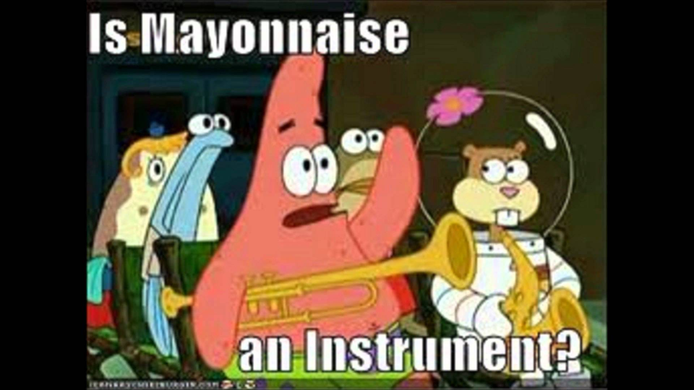

In the last blog post I wrote the most common critique I received was that
I alienated myself from most of my potential audience. In an email I expressed
to my Summer of Code mentor [Max Linke](http://www.biophys.mpg.de/en/hummer.html)
my problem:

>My number one worry in all of these matters is coming off as unrigorous or
pseudo-scientific, and I think I probably overcompensate by being borderline
inaccessible. I think this stems from some time spent enjoying a lack of rigor
and the fun that is being pseudo-scientific.  

[Cue Bill Nye making fun of Neil deGrasse Tyson for being full of it](https://www.youtube.com/watch?v=n0-jKmcNr_8).

For a while, after perusing blogs and social media, I thought, "Hey, I strongly
identify with this 'impostor syndrome' thing." Now I realize that's a pretty ignorant
and borderline insulting view to have. From what I can tell, I may have insecurities,
but the difference between my anxieties and people with who struggle with true
'impostor syndrome' is that someone has to have experience tangible evidence that
they are an outsider. As a straight white male, I don't have these problems.
So I guess in the future I will refrain from letting these anxieties be confused
with something more serious --- I have it pretty easy.

Going further, as a student and a tutor I noticed that far too often when people
were in over their heads, they would get quiet and close off to the outside
world. Especially in my math classes; a professor could be explaining Jordan
Normal Forms, reciting proofs and corollaries and lemmas as if they were
gospel, and although everyone was baffled, they would stay quiet. Nobody likes
it when someone dominates a lecture with their own questions and at the same
time a lot of people have missed fundamentals out of fear of sounding stupid.
If I’m ever asked in a job interview to give a personal strength, it would be
that I ask questions that might seem stupid with reckless abandon.

These posts are intended for people working to teach
themselves a some difficult topics. I apologize for being obtuse and abstract
and abstruse earlier. I will do my best to  teach things from an
intuition-first standpoint from here on and provide resources for refreshing
on math and statistics topics. *Please* get in touch with me if something I say
is unclear or wrong; this blog is as much for my own education as it is others.

-John
