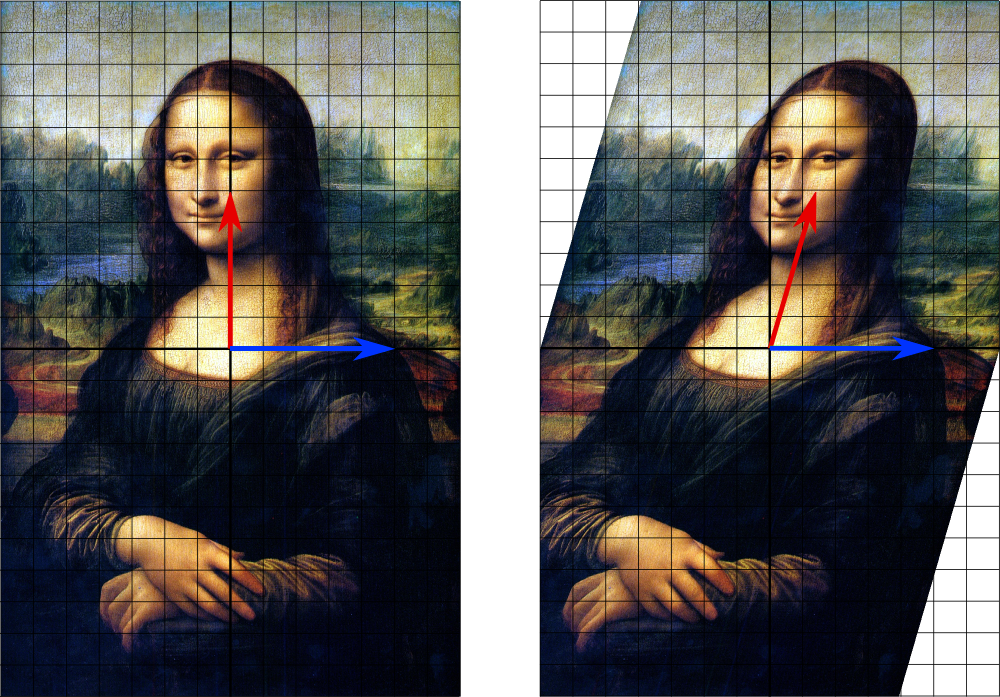
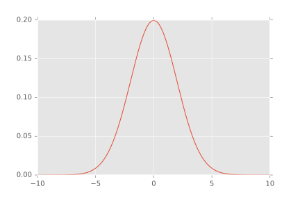
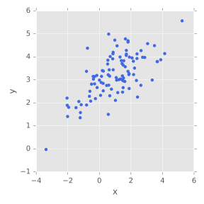
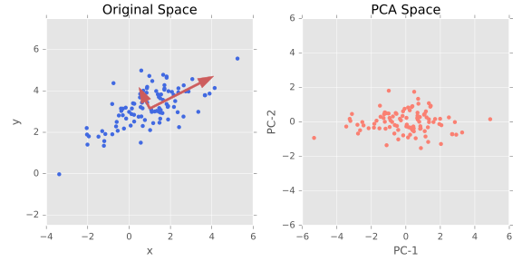

My next subject for bloggery is Principal Component Analysis (PCA)
(its sibling Multidimensional scaling has been left out for a future post,
but it is just as special, don’t worry). If I were to give a talk on PCA,
the slides would be roughly ordered as follows:

+ A very short recap of dimension reduction
+ PCA, what it stands for, rough background, history
+ Eigenvectors (what are those?!)
+ Covariance (Because variance matrix didn’t sound cool enough)
+ The very fancy sounding method of Lagrange Multipliers (why they aren’t that hard)
+ Explain the PCA Algorithm
+ Random Walks: What are they, how are they taken on a configuration space
+ Interpreting the results after applying PCA on MD simulation data

In reality not going to follow these bullet points, if you want to get information
pertaining to the first two points, please read some of my previous posts.
The last two points are going to be a subject for a post next week.

Here are some good sources for those seeking to acquaint themselves with
Linear Algebra and Statistics. [Multivariate Statistics and PCA](https://onlinecourses.science.psu.edu/stat505/node/2)
(Lessons two through 10) and the [Feynman Lecture on Physics: Probability](http://www.feynmanlectures.caltech.edu/I_06.html).
The Feynman lectures on physics are *so* good and *so* accessible. Richard
Feynman certainly had his flaws but teaching was not one of them. If you’re
too busy to read those, here’s a quick summary of some important ideas I
will be using.

What is a Linear Transformation, John?
-------
Glad you asked, friend! Let’s just stick to linearity.
for a function to be linear, it means that $f(a+b) = f(a) + f(b)$. As an
example of a non-linear function, consider $ y = x^{3} $ . After plugging
some numbers in we can see this is non-linear $ 2^{3} \neq 1^{3} + 1^{3} $.

A transformation at its most abstract is the description of an algorithm
that gets an object A to become an object B.
In linear algebra the transformation is being done on vectors belonging to a
domain (where vectors exist before the transformation) space  $V$ and a range
(where vectors exist after the transformation) space $W$. For the purposes of
our work, these are both $R^{n}$, the Cartesian product n-times of the real line.
(The standard (x,y) coordinate system is the Cartesian product of the real line
twice, or $R^{2}$)

When dealing with vector spaces, our linear transformation can be represented
by a $m$-by-$n$ matrix, where $n$ is the dimension of the space we are sending a
vector into (always less than or equal to m), and $m$ is the dimension of the
vector space in which our original vector (or set of vectors) being transformed
originally exists in. So if we have some set of $k$ vectors being transformed,
the matrices will be have row-by-column sizes:
$$[ k-by-m ] [m-by-n] = [k-by-n]$$. These maps can be scalings, rotations,
shearings and more.

What is a vector, what is an eigenvector?
---
Good question! A vector has a magnitude (which is just some positive number
for anything that we are doing) and a direction (a property that is drawn
from the *vector space* to which the vector belongs). Being told to walk 10
paces due north is to be given follow a vector with magnitude 10
and direction north. Vectors are presented as if they are centered at the origin,
and their *head* is reflects their magnitude and direction. This allows some
consistency when discussing things, when we are given the vector $(1,1)$ in $R^2$
we know it is centered at the origin, and thus has magnitude (from the distance
formula) of $\sqrt{2}$ and the direction is 45 degrees from the horizontal
axis. An <strong>eigenvector</strong> sounds a lot scarier than it is;
the purpose of an eigenvector is to answer the question,
‘what vectors don’t change direction under a given linear transformation?’

>This picture is stolen from wikipedia, but it should be clear that the
blue vector is an eigenvector of this transformation, while the red vector
is not.

The standard equation given when an eigenvalue problem is posed is:
$$ Mv = \lambda v $$
>$M$ is some linear transformation, $v$ is an eigenvector
we are trying to find, and $\lambda$ is the corresponding eigenvalue.

From this equation, we can see that eigenvector-eigenvalue pairs
are not unique; direction is not a unique property of a vector. If we
find a vector $v$ that satisfies this equation for our linear
transformation $M$, scaling the vector by some constant $\alpha$
will simply change the eigenvalue associated with the solution.
The vector $(1,1)$ in $R^2$ has the same direction as
$(2,2)$ in $R^2$. If one of these vectors isn’t subject to a direction change
(and therefore an eigenvector), then the other must be as well, because the
eigenvector-ness (yes, I just coined this phrase) applies to all vectors with
the same direction.

For those of you more familiar with Linear Algebra, this
should not be confused with the fact that a linear transformation can have
degenerate eigenvalues. This concept of degenerate eigenvalues comes up when
the rank of the matrix representation of a linear transformation is less than
its dimension, but given that our transformation has rank equal to to the
dimension of the vector space, we can ignore this.

Statistics in ~300 words
----
Sticking  one dimension, plenty of data seems to be random while also favoring
a central point. Consider the usual example of height across a population of
people. Height can be thought of as a *random variable*. But this isn’t random
in the way that people might think about randomness without some knowledge of
statistics. There is a central point where the heights of people tend to cluster,
and the likelihood of someone being taller or shorter than this central point
decreases on a ‘bell-curve’.

This is called a *normal distribution*. Many datasets can be thought of as
describing the a set of outcomes for some random variable in nature.
These outcomes are distributed in some fashion. In our example, the *mean* of
the data is the average height over the entire population. The *variance* of
our data is how far the height of a  is spread out from its mean. When the
distribution of outcomes follows a bell-curve such as it does in our example,
the distribution is referred to as *normal*. (There are some more
technical details, but the phrase normal stems from the fact that total area
under the bell-curve defined by the normal distribution is equal to one.) When
the data we want to describe is reflects more than one random variable this
is a *multivariate distribution*.

Statistics introduces the concept of *covariance* to describe the relationship
that random variables have with one another. The magnitude of a covariance indicates in some fashion the
relationship between random variables; it is not easily interpretable without
some set of constraints on the covariances, which will come up in
Principal Component Analysis. The sign of the covariance between two random
variables (X,Y) indicates if the two points are inversely related or directly
related.  A negative covariance between X and Y means that increasing X decreases
while a positive covariance means that increasing X increases Y. The normalized
version of covariance is called the *correlation coefficient* and might be
more familiar to those previously acquainted with statistics.

Constrained Optimization
---
Again, please do look at the Feynman Lectures, if you’re unfamiliar
with statistics look at the [Penn State](https://onlinecourses.science.psu.edu/stat505/node/2)
material for the ideas I just went over to better understand them.
The last subject I want to broach before getting into the details of PCA is
optimization with [Lagrange Multipliers](https://www.youtube.com/watch?v=nDuS5uQ7-lo).

Lagrange Multipliers are one method of solving a *constrained optimization problem*.
Such a problem requires an objective function to be optimized and constraints
to optimize against. An objective function is any function that we wish to
maximize or minimize to reflect some target quantity achieving an optimum value.
In short, the method of Lagrange Multipliers creates a system of linear equations
such that we can solve for a term $\lambda$ that shows when the objective
function achieves a maximum subject to constraints. In the case the of PCA, the
function we want to maximize is $M^{T} cov(X) M$, describing the
covariance of our data matrix $X$.  

PCA
---

Although it is not quite a fortuitous circumstance, the principal components of
the covariance matrix are precisely it's eigenvectors. For a multivariate dataset
generated by $n$ random variables, PCA will return a sequence of $n$ eigenvectors each
describing more covariance in the dataset than the next. The picture above
presents an example of the eigenvectors reflecting the covariance of a 2-dimensional
multivariate dataset.

To be perfectly honest, I don't know a satisfying way to explain why the eigenvectors
are the principal components. The best explanation I can come up with is that
the algorithm for PCA is in correspondence with the algorithm for eigenvalue
decomposition. It's one of those things where I *should* be able to provide a
proof for why the two problems are the same, but I cannot at the moment. (Commence
hand-waving...)

Let's look at the algorithm for Principal Component Analysis to better understand
things. PCA is an iterative method that seeks to create a sequence
of vectors that describe the covariance in a collection of data, each vector describing
more than those that will follow. This introduces an optimization problem, an
issue that I referenced earlier. In order to guarantee uniqueness of our solution,
this optimization is subject to constraints using Lagrange Multipliers.
remember, the video provides an example of a constrained optimization problem
from calculus. Principal Component Analysis finds this set of vectors by creating a linear
transformation $M$ that maximizes the covariance objective function given below.

PCA's objective function is  $trace(M^{T} cov(X) M)$, we are looking to maximize this.
From the Penn State lectures:
>Earlier in the course we defined the total variation of X as the trace of the
variance-covariance matrix, or if you like, the sum of the variances of the
individual variables. This is also equal to the sum of the eigenvalues.

In the first step of PCA, we can think of our objective function as:
$$a^T cov(X) a$$
>$a$ in this case is a single vector

We seek to maximize this a term such that the sum of the squares of the coefficients
of a is equal to one. (In math terms this is saying that the
$L^2$ norm is one). This constraint is introduced to ensure that a unique answer
is obtained, (remember eigenvectors are not unique, this is the same process one
would undertake to get a unique sequence of eigenvectors from a decomposition!).
In the second step, the objective function is :
$$B^T cov(X) B$$
>$B$ consists of $a$ and a new vector $b$

We look to maximize $b$ such that it explains covariance *not*
previously explained by the first, for this reason we introduce an
optimization problem with two constraints:

+ $a$ remains the same
+ The sum of the squares of the coefficients of $b$ equals one
+ None of the covariance explained by vector $a$ is explained by $b$, (the two vectors are *orthogonal*, another property of eigenvectors!)

This process is repeated for the entire transformation $M$. This gives us a sequence
of eigenvalues that each reflect some fraction of the covariance, and sum to one.
For our previously mentioned n-dimensional multivariate dataset, generally some
number $k \lt n$ of eigenvectors explain the total variance well enough to ignore
the $n - k$ vectors remaining. This gives a set of principal components to investigate.  

It might follow that this corresponds to an eigenvalue problem:
$$cov(X)M = \lamba M$$
If it doesn’t appear to be clear, let’s step back and
look again at eigenvectors. As I said earlier, eigenvectors provide insight
into what vectors don’t change direction under a linear map. We are trying find
a linearly independent set of vectors that provide insight into the structure
of our covariance from our multivariate distribution. Eigenvectors are either
the same or orthogonal. This algorithm we described, is *precisely* the
algorithm one would use to find the eigenvectors of any (full-rank) linear transformation,
not just the linear transformation done in Principal Component Analysis.

Chemistry application and interpretation:
---
Before PCA is done on an MD Simulation, we have to consider what goals we
have for the analysis of results. We are searching to arrange the data
outputted by PCA such it gives us intuition into some physical behavior of our
system. This is usually done a single structure, and in order to focus insight
on relative structural change rather than some sort of translational motion of
the entire structure, an alignment of an entire trajectory to some structure of
interest by minimization of the Root Mean Square Distance must be done prior to
analysis. After RMS alignment, any variance in data should be variance due to
changes in structure.  

Cecilia Clementi has this quote in her Free Energy Landscapes paper:
>Essentially, PCA computes a hyperplane that passes through the data points as
best as possible in a least-squares sense. The principal components are the
tangent vectors that describe this hyperplane

How do we interpret n-dimensional physical data from the tangent vectors of an
k-dimensional hyperplane embedded in this higher dimensional space? This is all
very mathematical and abstract, . What we do is reduce the analysis to some
visually interpretable subset of components, and see if there is any indication
of clustering that occurs.  

Remember, we have an explicit linear map relating the higher dimensional
space to the lower-dimensional space . By taking our trajectory and projecting
it onto one of the set of eigenvector components of our analysis, we can
extract embeddings in different ways, from Clementi again:

>So, the first principal component corresponds to the best possible projection onto
a line, the first two correspond to the best possible projection onto a plane, and so on.
Clearly, if the manifold of interest is inherently non-linear the low-dimensional e
mbedding obtained by means of PCA is severely distorted… The fact that empirical
reaction coordinates routinely used in protein folding studies can not be
reduced to a linear combination of the Cartesian coordinates underscores the
inadequacy of linear dimensionality reduction techniques to characterize a
folding landscape.

Again, this is all esoteric for the lay reader. What is a manifold, a reaction
coordinate, a linear combination of cartesian coordinates? All we should know is
that PCA is a limited investigational tool for complex systems, the variance the
principal components explain should not necessarily be interpreted as physical
parameters governing the behavior of a system.

My mentor max has a great Jupyter notebook up demonstrating PCA done on MD
simulations [here](https://gist.github.com/kain88-de/0bfe0813e27ad601004b247fedb2ee7d).
All of these topics are covered in the notebook and should be relatively accessible
if you understand what I've said so far. In my next post I will write about how
I will be implementing PCA as a module in MDAnalysis.

-John
